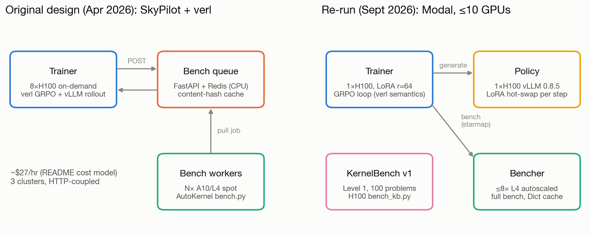

# Kernel-Writer-RL-v2: an LLM agent that writes Triton kernels, with a GPU benchmark as the reward

An LLM agent (Qwen2.5-Coder-7B-Instruct) writes a full Triton `kernel.py`. A real GPU runs a
fixed benchmark (correctness stages, then timing against PyTorch), and the result is the
verifiable reward and the agent's next message. The original design (April 2026, SkyPilot + verl)
is in [`src/`](src/). The original results were lost with an old disk, so every number here comes
from the September 2026 re-run on Modal ([`modal_app/`](modal_app/)). That re-run trained the agent
with GRPO, found and fixed bugs in both verifiers (AutoKernel `bench.py` and KernelBench
`bench_kb.py`), and then tested SFT before more RL.

**Website:** https://ramshankar07.github.io/Kernel-Writer-RL-v2/
([method](https://ramshankar07.github.io/Kernel-Writer-RL-v2/method.html) ·
[RL](https://ramshankar07.github.io/Kernel-Writer-RL-v2/rl.html) ·
[verifier](https://ramshankar07.github.io/Kernel-Writer-RL-v2/verifier.html) ·
[SFT](https://ramshankar07.github.io/Kernel-Writer-RL-v2/sft.html) ·
[reproduce](https://ramshankar07.github.io/Kernel-Writer-RL-v2/reproduce.html))

## Headline results

Every value is copied from the source file in the last column. "Base" means
Qwen2.5-Coder-7B-Instruct with no training. "SFT" means the LoRA `sft_v1` checkpoint at step 378.

| Result | Value | Source |
|---|---|---|
| SFT raises validation pass@1 (62 held-out problems, 4 turns) | 0.383 → 0.508 | [`results/v3/phase3.md`](results/v3/phase3.md) |
| SFT cuts Triton compile errors (per turn) | 0.081 → 0.019 (8.1% → 1.9%) | [`results/v3/phase3.md`](results/v3/phase3.md) |
| KernelBench L1 PASS with a launched `@triton.jit` kernel (kb v2, 100 problems) | 0.00 → 0.20 (0/100 → 20/100) | [`results/v3/phase3.md`](results/v3/phase3.md) |
| ... of which on problems whose ops are not in the SFT data | 0/59 → 7/59 | [`results/v3/phase3.md`](results/v3/phase3.md) |
| GRPO v1 (original reward, 18 steps) stalled: mean share of zero-advantage groups | 0.6543 (65%) | [`results/numbers.json`](results/numbers.json) (`grpo.grpo_v1.zero_adv_mean`) |
| GRPO v1 reward / pass rate, first 3 steps → last 3 steps | 0.0981 → 0.1147 / 0.2917 → 0.25 | [`results/numbers.json`](results/numbers.json) |
| Share of GRPO v1's \|advantage\| that came from timing-noise groups (0 < std < 0.02) | 78.9% (Dr. GRPO, no std division: 6.2%) | [`results/extra_numbers.json`](results/extra_numbers.json) (`dr_grpo_whatif`) |
| RMSNorm "2.9x" kernel: the speedup was already in the starter, and GRPO's fp32 → fp16 edit is a reward hack | best vs starter 1.004x; returns zeros for RMS>4 at N=4096 | [`results/v3/rmsnorm_remeasure.md`](results/v3/rmsnorm_remeasure.md) |
| GRPO kernels with a real speedup vs their starter (bench v2 rescore of 362 old PASS kernels) | **0** | [`results/v3/bench_v2.md`](results/v3/bench_v2.md) |
| Speed not improved by SFT: geomean speedup vs starter (solving episodes) | 0.950 → 1.003 | [`results/v3/phase3.md`](results/v3/phase3.md) |
| Beat the starter by >5% (pass@1) | 0.028 → 0.008 | [`results/v3/phase3.md`](results/v3/phase3.md) |

In short, SFT taught the model to write correct Triton that compiles, but not fast Triton. GRPO never got
a real speed signal: most groups had no variance, and most of the variance it did get was timing noise.

## Architecture



The April 2026 design used three HTTP-coupled SkyPilot clusters: an 8xH100 verl trainer, a
FastAPI + Redis bench queue, and spot GPU bench workers. The Modal re-run fits the same GRPO loop
under a 10-GPU cap. One H100 runs the trainer (LoRA r=64), one H100 serves the vLLM policy with the
LoRA hot-swapped each step, and up to 8 autoscaled L4 benchers run the full AutoKernel bench behind
a content-hash cache. KernelBench Level 1 on H100 is the held-out transfer eval.

## Repository map

| Path | What is in it |
|---|---|
| [`src/`](src/) | Original April 2026 design: SkyPilot clusters, verl trainer config, bench server and worker, agent loop, reward ([`src/autokernel-rlvr/`](src/autokernel-rlvr/)) |
| [`modal_app/`](modal_app/) | The Modal re-run: bench apps (v1 and fixed v2), KernelBench apps (v1 and v2), vLLM policy, agent eval, GRPO trainer, `reward_v2.py`, the SFT pipeline (`sft_*.py`), validation set and eval (`val_*.py`), report generators |
| [`results/`](results/) | Every measured number: `numbers.json` (stages 1 to 3), `extra_numbers.json` (GRPO analyses), `grpo/` (GRPO metrics and rollouts), `v3/` (verifier fixes, RMSNorm re-measurement, SFT phases 0 to 3) |
| [`results/autokernel_src/`](results/autokernel_src/) | Vendored AutoKernel `bench.py`, `reference.py` and starter kernels (MIT) |
| [`presentation/`](presentation/) | Figures (`figures/`, `v2/figures/`), decks (`deck.pptx`, `v3/deck_v3.pptx`), and generators for the write-up and the 30-question Q&A (`make_docs.py` → `writeup.md`, `qa_30.md`) |

## Quickstart

You need a [Modal](https://modal.com) account and a Modal secret named `huggingface-secret`, which
`policy.py`, `train_grpo.py` and `sft_train_modal.py` use. The account cap is 10 concurrent GPUs.
Bench pools use at most 8 (`BENCH_MAX_CONTAINERS` in `modal_app/common.py`), so run only one GPU
stage at a time.

```bash
pip install modal
modal setup                      # authenticate the CLI
```

**1. Deploy the apps once**

```bash
cd modal_app
modal deploy bench_modal.py        # autokernel-bench: Bencher.run(kernel_type, code, quick)
modal deploy kernelbench_modal.py  # autokernel-kernelbench: KBBencher.run(problem_id, code)
modal deploy policy.py             # autokernel-policy: vLLM Qwen2.5-Coder, LoRA hot-swap
```

**2. Run a stage**

| Stage | Command (from `modal_app/` unless noted) | Output |
|---|---|---|
| Bench smoke test | `modal run bench_modal.py::smoke` | stdout |
| 1. Starter baselines | `modal run bench_modal.py::stage1` | `results/stage1_baselines.jsonl` |
| 1b. KernelBench identity sanity check | `modal run kernelbench_modal.py::sanity` | `results/kb_sanity.jsonl` |
| 2. Agent eval, no training | `modal run agent_eval.py --suite autokernel --n 8 --max-turns 8` | `results/agent_eval/*.jsonl` |
| 3. GRPO | `modal deploy train_grpo.py`, then spawn `modal.Function.from_name("autokernel-grpo","train")` with `run=..., reward="v1"\|"v2"` | Volume `grpo/<run>/` |
| Validation eval (repo root) | `modal deploy modal_app/val_bench_modal.py` then `modal run modal_app/val_eval.py --n 2 --max-turns 4 --tag half1` | `results/v3/phase0_runs/` (`--out-dir` to change) |
| KernelBench L1, kb v2 (repo root) | `modal deploy modal_app/kernelbench_v2_modal.py` then `modal run modal_app/kb_v2_agent_eval.py --tag kb2_base` | `results/v3/phase3_runs/` |

Use `.spawn()` instead of `modal run --detach` for long jobs. A detached GRPO run was cancelled at step 5.

**3. SFT data and training** (the datasets are not in the repo; this rebuilds them)

```bash
python3 modal_app/sft_ingest_drkernel.py          # CPU: Dr. Kernel -> candidates
python modal_app/sft_ingest_kernelbook.py          # CPU: KernelBook @ 1576375b -> candidates
python modal_app/sft_ingest_inrepo.py              # CPU: in-repo PASS kernels + repair pairs
cd modal_app && modal deploy sft_verify_modal.py
modal run sft_verify_modal.py::run --source drkernel --limit 0   # GPU verification, resumable
cd .. && python modal_app/sft_decontam.py results/v3/sft/candidates_drkernel.jsonl
python modal_app/sft_assemble.py                   # -> results/v3/sft/sft_{train,dev}.jsonl
cd modal_app && modal deploy sft_train_modal.py    # then spawn autokernel-sft-train/train(run='sft_v1')
```

**4. Regenerate numbers, figures and docs (no GPU)**

```bash
python modal_app/analyze.py            # -> results/numbers.json
python presentation/make_figures.py    # -> presentation/figures/*.png
python presentation/make_docs.py       # -> presentation/writeup.md, qa_30.md
python3 modal_app/phase3_report.py     # -> results/v3/phase3.md, phase3.json
python3 presentation/v3/make_v3_numbers.py && node presentation/v3/build_deck_v3.js   # v3 deck
```

Unit tests: `python modal_app/test_sft_assemble.py` and `python modal_app/test_sft_decontam.py`.

## Reports to read

| Report | What it covers |
|---|---|
| [`results/v3/phase3.md`](results/v3/phase3.md) | SFT vs base on the validation set and KernelBench L1, the gate for resuming GRPO, and whether a speed reward would have any signal |
| [`results/v3/rmsnorm_remeasure.md`](results/v3/rmsnorm_remeasure.md) | Independent L4/H100 re-measurement of the "2.9x" RMSNorm kernel, and why the verifier rewarded the fp16 overflow |
| [`results/v3/bench_v2.md`](results/v3/bench_v2.md) | Fixed AutoKernel harness, plus a rescore of every old PASS kernel |
| [`results/v3/kb_v2.md`](results/v3/kb_v2.md) | Fixed KernelBench harness: identity sanity check 55/100 → 100/100 |
| [`results/v3/sft_plan.md`](results/v3/sft_plan.md) | Why SFT before more GRPO, and the phase plan and gates |
| [`presentation/writeup.md`](presentation/writeup.md) | Short write-up of the Modal re-run (stages 1 to 3, GRPO v1/v2) |

## Data and licenses

| Item | License / terms |
|---|---|
| This project | Apache-2.0 ([`LICENSE`](LICENSE)) |
| Vendored AutoKernel code ([`results/autokernel_src/`](results/autokernel_src/)) | MIT ([`results/autokernel_src/LICENSE`](results/autokernel_src/LICENSE)) |
| GPUMODE/KernelBook (SFT source) | MIT at the pinned revision `1576375b` (later revisions changed the license) |
| hkust-nlp/drkernel-coldstart-8k (SFT source) | GPT-5-distilled trajectories, so OpenAI output-use terms may apply |
| SFT datasets (`results/v3/sft/*.jsonl`) | **Not included** (git-ignored). Rebuild them with `modal_app/sft_ingest_*.py` → `sft_verify_modal.py` → `sft_assemble.py`. Summaries and the mix report are committed in [`results/v3/sft/`](results/v3/sft/) |

## Status and verdict

- **Done:** baselines, agent eval, GRPO v1 (18 steps) and v2 (10 steps), fixed verifiers (bench v2,
  kb v2), RMSNorm re-measurement, and SFT phases 0 to 3. GRPO was not resumed after SFT, for budget reasons.
- **What worked:** fixing the verifiers, and SFT for correctness. SFT raised pass@1 by 0.125
  (more than 2x the seed spread), compile errors became rare, and KernelBench L1 went from 0 to 20/100
  Triton solutions, including 7/59 on problems whose ops the SFT data never covered.
- **What did not:** speed. No GRPO kernel beats its starter under the fixed bench, and the one
  headline speedup (RMSNorm 2.9x) is starter fusion plus a reward hack that exploits an fp16 overflow in
  the reference. After SFT, only 2 of 126 solved validation episodes beat the starter by more than 5%,
  so a speed reward would mostly re-teach correctness.
- **Lesson:** an RL reward is only as good as its verifier, and a verifier needs adversarial tests
  (large magnitudes, a launch check, seeded weights, hidden seeds) before any speedup can be trusted.
