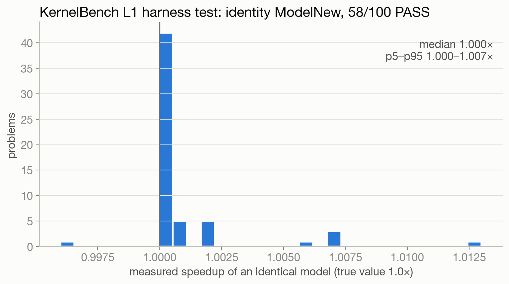
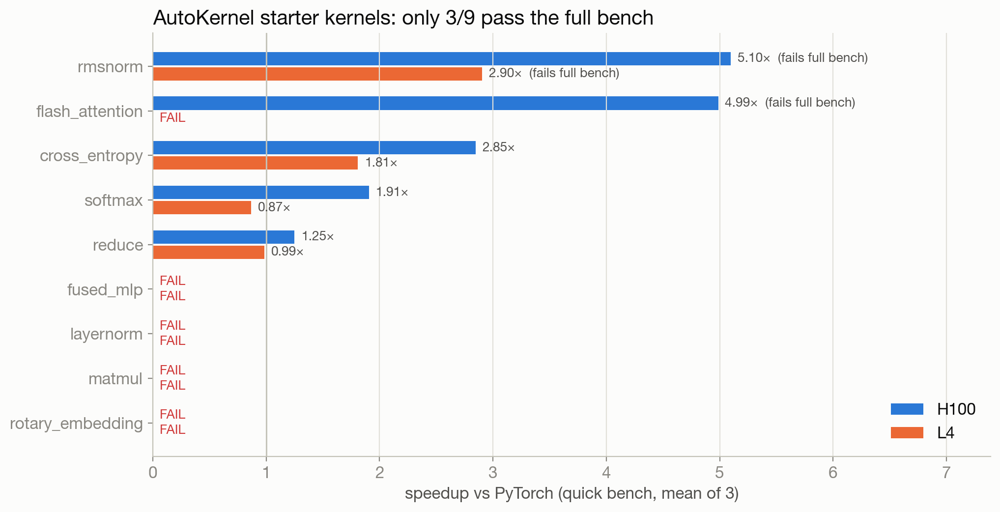
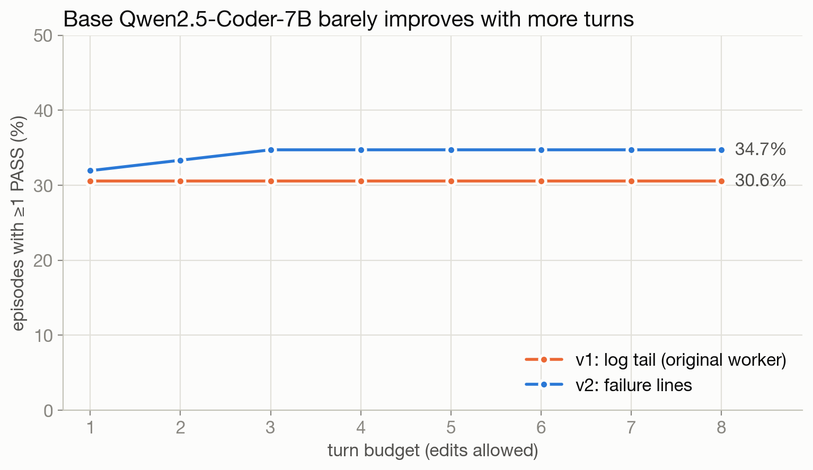
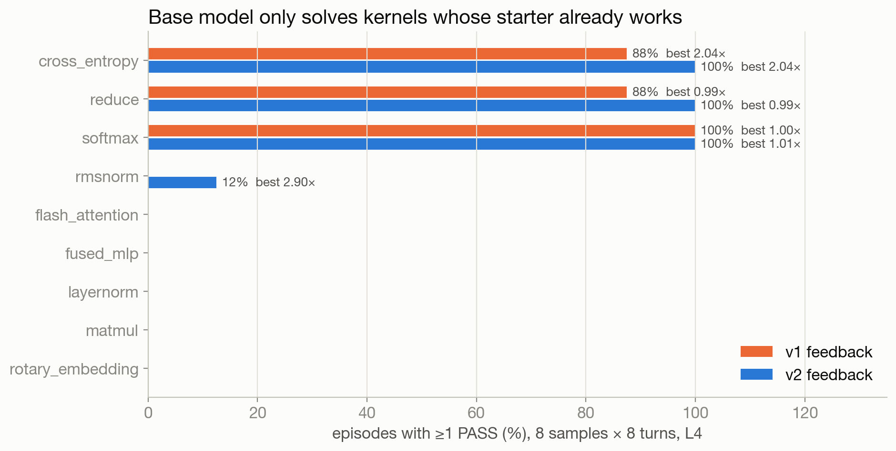
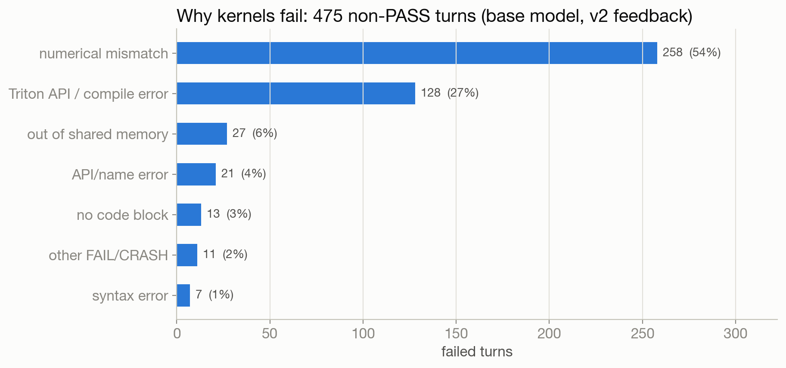
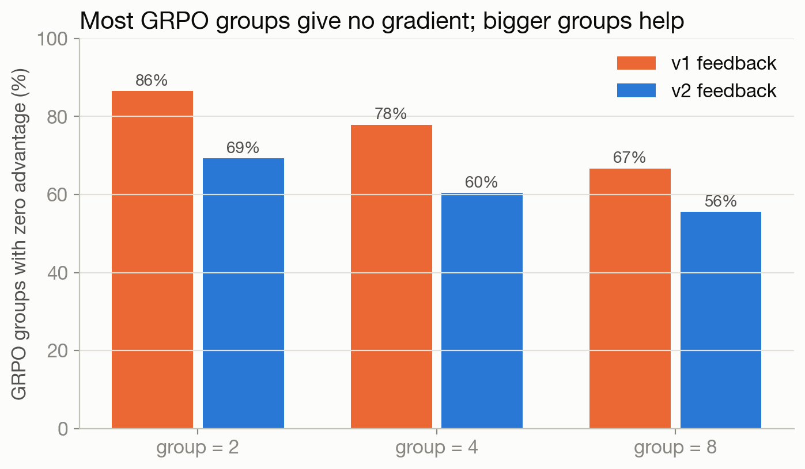
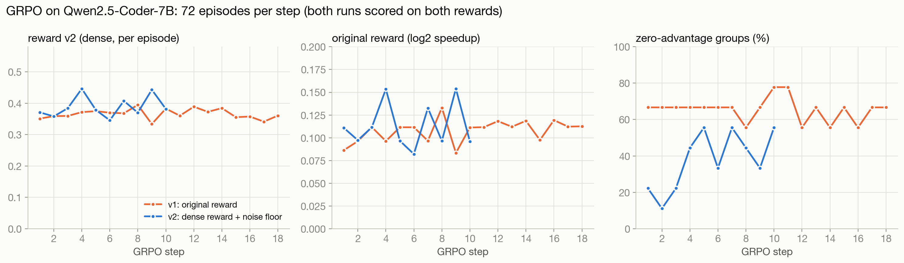
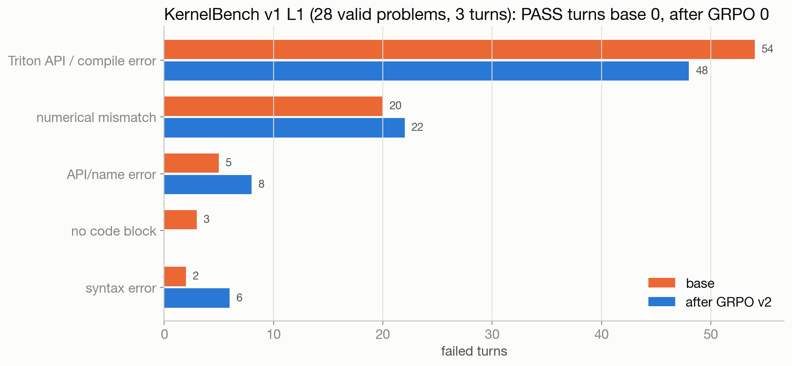

# AutoKernel-RLVR: teaching an LLM to write faster GPU kernels

*Modal re-run, Sept 2026. Every number is generated from `results/numbers.json`; figures in `presentation/figures/`; 30 follow-up Q&As in `qa_30.md`.*

## 1. What the project is

An LLM agent (Qwen2.5-Coder-7B-Instruct) is trained with GRPO to optimize GPU kernels. Each episode, it writes a full Triton `kernel.py`, a real GPU runs AutoKernel's fixed `bench.py` (5 correctness stages + timing vs PyTorch), and the result comes back as the next message. Reward = log2(best speedup) if any turn passes, else 0, clipped to [−1, 3].

## 2. Where it started: KernelBench v1

The first test set was KernelBench Level 1 (100 PyTorch ops). Rebuilt on Modal, an identity solution passes 58/100 problems at a median 1.000× measured speedup, so the timing is sound. But only 55 problems are harness-valid (35 conv problems have unseeded weights), and a bench takes a median 20.94 s on H100 vs 5.95 s for AutoKernel's bench on L4. That's why RL moved to AutoKernel's 9 kernel types, with KernelBench kept as the held-out eval.

## 3. The verifier

Only 3/9 of AutoKernel's own starter kernels pass the full bench. Quick mode skips numerical stability and lets flash_attention, rmsnorm pass, so all rewards use the full bench. Run-to-run noise is at most 1.89% CV.

## 4. The base model, and a free win from better feedback

Untrained, the model passes in 34.7% of episodes (fast_1.0 15.3%), mostly by resubmitting kernels whose starter already works. Extra turns barely help. With the original design's feedback (the log tail) pass@turn was flat at 30.6%. Sending the actual failure lines raised it to 34.7% and mean reward from 0.0966 to 0.1327, with no training.

## 5. GRPO

GRPO learns only from groups whose rewards differ. On base-model rollouts 60.4% of 4-sample groups and 55.6% of 8-sample groups were all-equal, so training uses group=8, 4 turns, LoRA r=64, lr 1e-5.

**v1 (original reward), 18 steps:** reward 0.0981 → 0.1147, pass rate 29.2% → 25.0%. 65.4% of groups gave no gradient: 5 kernels never passed in any of the 18 × 72 episodes.

**v2 (dense correctness credit + PASS floor + noise-floor ties), 10 steps:** reward_v2 0.3713 → 0.3985, original reward 0.1066 → 0.1154, pass rate 31.5% → 31.9%.

## 6. Transfer to KernelBench v1

Base fast_0 0.0%, after GRPO 0.0%.

## 7. Lessons

1. The verifier and its feedback matter more than expected: quick-mode rewards are exploitable, and log-tail feedback hid every failure reason.
2. The reward has a floor bug: a correct kernel slower than PyTorch scores below a crash.
3. GRPO signal is sparse when most groups all fail. Dense correctness credit cut the zero-gradient groups from 65% to 38%, but 10 steps weren't enough to solve new kernels; curriculum and more steps are next.
4. Re-running an old project found 5 real integration bugs (see `CLAUDE.md`).
